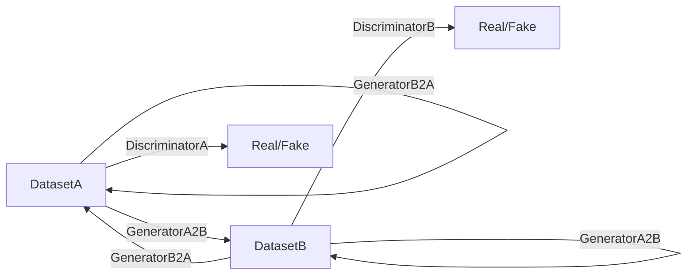
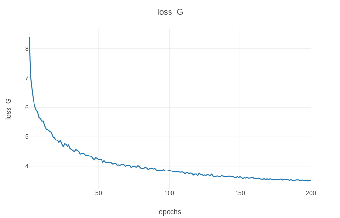
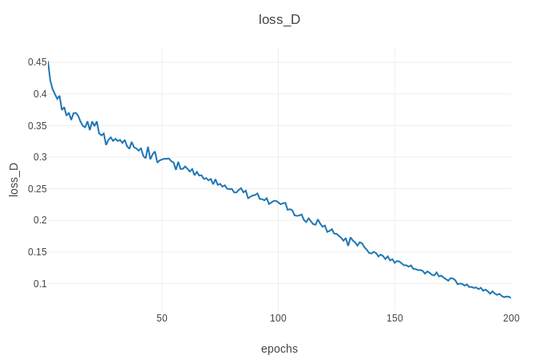
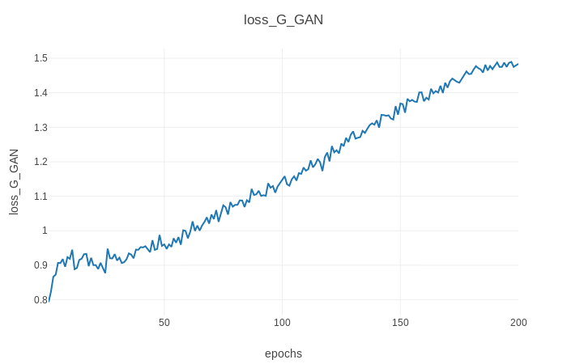
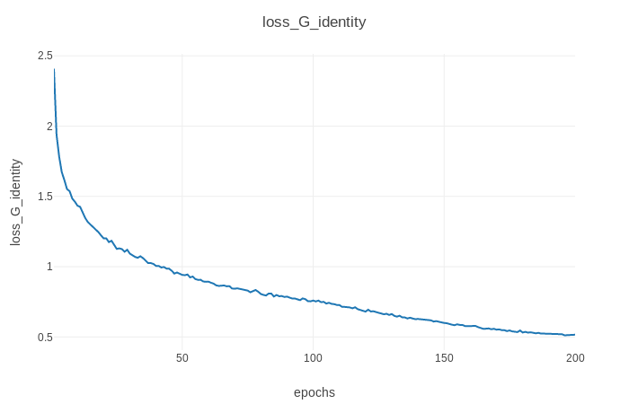
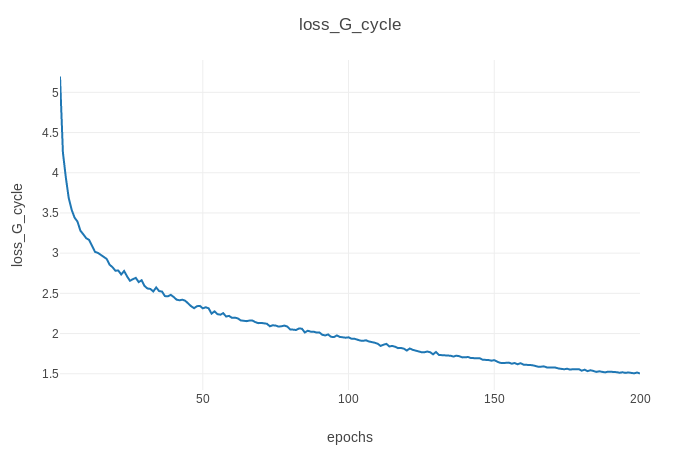

# Pytorch-CycleGAN
A clean and readable Pytorch implementation of CycleGAN (https://arxiv.org/abs/1703.10593)

## Prerequisites
Code is intended to work with ```Python 3.6.x```, it hasn't been tested with previous versions

### [PyTorch & torchvision](http://pytorch.org/)
Follow the instructions in [pytorch.org](http://pytorch.org) for your current setup

### [Visdom](https://github.com/facebookresearch/visdom)
To plot loss graphs and draw images in a nice web browser view
```
pip3 install visdom
```

## Model Structure



## Training
### 1. 数据集准备
    .
    ├── datasets                   
    |   ├── <dataset_name>         # i.e. brucewayne2batman
    |   |   ├── train              # Training
    |   |   |   ├── A              # Contains domain A images (i.e. Bruce Wayne)
    |   |   |   └── B              # Contains domain B images (i.e. Batman)
    |   |   └── test               # Testing
    |   |   |   ├── A              # Contains domain A images (i.e. Bruce Wayne)
    |   |   |   └── B              # Contains domain B images (i.e. Batman)
### 生成器损失
>loss_G = loss_identity_A + loss_identity_B + loss_GAN_A2B + loss_GAN_B2A + loss_cycle_ABA + loss_cycle_BAB

> loss_identity_A = ||GeneratorB2A(A) - A||

> loss_identity_B = ||GeneratorA2B(B) - B||

> loss_GAN_A2B = MSE(DiscriminatorB(GeneratorA2B(A)))

> loss_GAN_B2A = MSE(DiscriminatorA(GeneratorB2A(B)))


    
### 2. Train!
```
./train --dataroot datasets/<dataset_name>/ --cuda
```







## Testing
```
./test --dataroot datasets/<dataset_name>/ --cuda
```
This command will take the images under the *dataroot/test* directory, run them through the generators and save the output under the *output/A* and *output/B* directories. As with train, some parameters like the weights to load, can be tweaked, see ```./test --help``` for more information.

Examples of the generated outputs (default params, horse2zebra dataset):


## Acknowledgments
Code is basically a cleaner and less obscured implementation of [pytorch-CycleGAN-and-pix2pix](https://github.com/junyanz/pytorch-CycleGAN-and-pix2pix). All credit goes to the authors of [CycleGAN](https://arxiv.org/abs/1703.10593), Zhu, Jun-Yan and Park, Taesung and Isola, Phillip and Efros, Alexei A.
